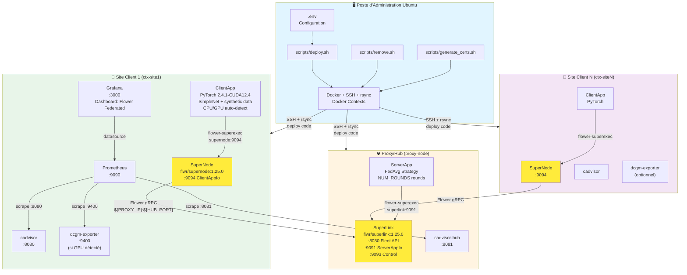

# Plateforme Flower orchestrée (SuperLink/SuperNode) avec monitoring GPU

Cette plateforme fournit une pile d'apprentissage fédéré basée sur **Flower 1.25** empaquetée avec Docker Compose.
Elle cible un déploiement multi-hôtes (proxy/hub + nœud GPU) piloté depuis un poste d'administration Ubuntu et inclut
une supervision complète Prometheus/Grafana (CPU/RAM/GPU, réseau, état du SuperLink). Les scripts fournis automatisent
la synchronisation du dépôt, la génération des certificats TLS et le démarrage des services via Docker Contexts.

## Sommaire
- [Architecture et composants](#architecture-et-composants)
- [Arborescence du dépôt](#arborescence-du-dépôt)
- [Prérequis](#prérequis)
- [Configuration](#configuration)
- [Déploiement automatisé multi-hôtes](#déploiement-automatisé-multi-hôtes)
- [Exécution locale (monohôte) pour test](#exécution-locale-monohôte-pour-test)
- [Services Docker Compose](#services-docker-compose)
- [Applications Flower](#applications-flower)
- [Ajouter un nouveau site client](#ajouter-un-nouveau-site-client)
- [Entraîner un modèle réel : workflow](#entraîner-un-modèle-réel--workflow)
- [Monitoring](#monitoring)
- [Logs, diagnostics et nettoyage](#logs-diagnostics-et-nettoyage)
- [FAQ rapide](#faq-rapide)

## Architecture et composants



- **Profiles Compose** : `hub` (proxy), `client` (sites), `monitor` (par site) et `monitor-gpu` (ajouté automatiquement quand un GPU est détecté). Ils peuvent être lancés ensemble ou séparément.
- **Réseau** : chaque SuperNode se connecte au SuperLink via `${PROXY_IP}:${HUB_PORT}` ; les AppIo internes utilisent les ports 9091 (hub) et 9094 (client) exposés uniquement sur le réseau docker.
- **Sécurité** : certificats TLS générés localement (`scripts/generate_certs.sh`) puis montés côté SuperLink/SuperNode si besoin d'activer le mode sécurisé (désactivé par défaut avec `--insecure`).
- **Monitoring** : une pile Prometheus/Grafana par site client (profil `monitor`), reliée à `cadvisor-hub` via le port 8081 et à chaque `cadvisor`/`dcgm-exporter` local.

## Arborescence du dépôt
```
.
├── compose.yaml                   # Orchestration hub/client/monitoring via profils
├── compose.gpu.yaml               # Surcharge facultative pour activer GPU/monitoring DCGM quand disponible
├── .env.example                   # Variables partagées (copier en .env)
├── scripts/
│   ├── deploy.sh                  # Déploiement automatisé multi-sites via Docker Context + rsync
│   ├── remove.sh                  # Supprime les éléments déployé
│   └── generate_certs.sh          # Génération CA + certificats TLS serveur/client(s)
├── orchestrator/                  # ServerApp Flower (hub)
│   ├── Dockerfile
│   ├── app/server.py              # FedAvg, rounds pilotables via NUM_ROUNDS/run_config
│   └── run.sh                     # Lance flower-superexec vers le SuperLink
├── client/                        # ClientApp Flower (PyTorch)
│   ├── Dockerfile
│   ├── app/client.py              # NumPyClient avec données synthétiques, hyperparams dynamiques
│   └── run.sh                     # Lance flower-superexec vers le SuperNode local
└── monitoring/
    ├── prometheus.tmpl.yml        # Exemple local (écrasé par deploy.sh en prod)
    ├── prometheus/prometheus.yml  # Fichier généré/utilisé par le conteneur
    └── grafana-provisioning/      # Datasource + dashboard « Flower Federated Overview »
```

### Points clés supplémentaires
- `compose.gpu.yaml` ajoute automatiquement les réservations NVIDIA et le service `dcgm-exporter` pour exposer les métriques GPU.
- Les dossiers `certs/` (certificats TLS) et `data/` (jeux de données locaux éventuels) ne sont pas versionnés : ils doivent être créés au moment du déploiement.
- Les scripts `run.sh` de `client/` et `orchestrator/` encapsulent l'appel à `flower-superexec` avec l'adresse AppIo adaptée.

## Prérequis
- Poste d'**administration Ubuntu** avec Docker et le plugin Docker Compose.
- Accès **SSH sans mot de passe** vers :
  - le proxy/hub (`${PROXY_IP}`)
  - chaque site client listé dans `${CLIENT_SITES}` (voir Configuration)
- GPU NVIDIA et runtime CUDA **recommandés** sur les sites clients (pour accélérer l'entraînement et activer `dcgm-exporter`). En leur absence, le déploiement reste fonctionnel en CPU.
- Fichier `~/.ssh/config` configuré pour le proxy et les sites (utilisateur, clé, etc.).
- Python 3 + module PyYAML installés sur le poste d'admin (utilisés par `scripts/deploy.sh`).
- (Optionnel) Accès sudo sur les hôtes pour installer `rsync` si absent.

### Variables d'environnement principales (`.env`)
| Variable | Rôle | Exemple |
| --- | --- | --- |
| `PROXY_IP` | Alias SSH ou IP publique du proxy/hub | `proxy-host` |
| `HUB_INTERNAL_IP` / `HUB_PUBLIC_IP` | Adresses internes/publiques utilisées par les clients (site1 utilise l'interne) | `10.0.0.10` / `198.51.100.10` |
| `CLIENT_SITES` | Liste `nom:ip` ou `nom:alias ssh` des sites | `site1:10.0.0.21,site2:gpu-remote` |
| `FLWR_VERSION` | Version Flower utilisée par les images SuperLink/SuperNode | `1.25.0` |
| `NUM_ROUNDS` | Nombre de rounds serveur par défaut | `5` |
| `BATCH_SIZE`, `LEARNING_RATE`, `N_LOCAL_EPOCHS` | Hyperparamètres clients (surchargés par `run_config` si fourni) | `64`, `0.01`, `1` |
| `GRAFANA_PORT`, `PROMETHEUS_PORT` | Ports exposés pour la stack monitoring | `3000`, `9090` |
| `HOST_PROJECT_PATH` | Chemin du dépôt côté hôte (utile quand le bind mount diffère) | `/home/user/federatedlearning` |

## Configuration
1. Copiez le modèle :
   ```bash
   cp .env.example .env
   ```
2. Ajustez les variables clés :
   - **Réseau** : `PROXY_IP`, `CLIENT_SITES` (format `nom:ip,nom2:ip2`), `HUB_PORT`
   - **Flower** : `FLWR_VERSION` (1.25.0), `NUM_ROUNDS` (rounds serveur)
   - **Hyperparamètres client** : `BATCH_SIZE`, `LEARNING_RATE` (utilisés par `client/app/client.py`)
   - **Monitoring** : `GRAFANA_PORT`, `PROMETHEUS_PORT`
   - **Déploiement** : `HOST_PROJECT_PATH` si le chemin du dépôt côté hôte diffère (`bind mounts` Prometheus/Grafana)

## Déploiement automatisé multi-hôtes
Exécuté depuis le poste admin (répertoire racine du dépôt).

1) Rendez les scripts exécutables si besoin :
```bash
chmod +x scripts/deploy.sh scripts/generate_certs.sh
```

2) (Optionnel) Générer les certificats TLS (SuperLink / SuperNode) :
```bash
./scripts/generate_certs.sh                              # génère la CA + un client "client"
./scripts/generate_certs.sh site-lyon CLIENT_SAN="IP:10.0.0.10"  # exemple : certificat client dédié
```
Les certificats sont placés dans `certs/` (non versionné).

3) Lancez le déploiement complet :
```bash
./scripts/deploy.sh
```
Le script :
- charge `.env` (proxy + liste des sites clients) ;
- vérifie/installe `rsync` sur chaque hôte ;
- crée les **Docker Contexts** `proxy-node` puis `ctx-<site>` pour chaque entrée `nom:ip` ;
- synchronise le dépôt sur chaque hôte (`rsync --delete`) ;
- déploie le hub sur le proxy, puis **boucle sur tous les sites** pour démarrer les profils `client` + `monitor` ;
- détecte automatiquement la présence d'un GPU sur chaque site pour ajouter `compose.gpu.yaml` et le profil `monitor-gpu` le cas échéant ;
- génère un `monitoring/prometheus/prometheus.yml` qui référence automatiquement chaque site ;
- affiche les URLs utiles (Hub + premier site pour Grafana/Prometheus) en fin de déploiement.

> Astuce : définir `DEPLOY_LOG_FOLLOW=true` avant d'exécuter le script permet de suivre les journaux `docker compose` en direct et d'identifier rapidement les services `unhealthy`.

4) Points d'accès après déploiement :
- Fleet API hub : `http://${PROXY_IP}:${HUB_PORT}`
- Grafana / Prometheus : `http://<IP_site_client>:{${GRAFANA_PORT}|${PROMETHEUS_PORT}}` (par défaut le premier site de la liste)

## Exécution locale (monohôte) pour test
Pour expérimenter sans SSH (tout sur la même machine) :
```bash
docker compose --profile hub --profile client --profile monitor up -d --build
```
- Le fichier `monitoring/prometheus/prometheus.yml` versionné pointe par défaut sur `cadvisor:8080` et `${PROXY_IP}:${PROXY_METRICS_PORT:-8081}`.
  - Quand Prometheus tourne sur un autre hôte que le proxy, exposez `fl-cadvisor-hub` en `8081` (mapping `8081:8080`) et laissez la valeur par défaut.
  - Quand Prometheus partage le même réseau Docker que `fl-cadvisor-hub` (ex. profil `monitor` lancé sur le proxy), définissez `PROXY_METRICS_PORT=8080`.
  - Régénérez le fichier via `scripts/deploy.sh` après ajustement des variables.
- Sur une machine équipée d'un GPU et du runtime NVIDIA, ajoutez `-f compose.gpu.yaml --profile monitor-gpu` pour activer les réservations GPU et le service `dcgm-exporter`. Sans GPU, la pile fonctionne automatiquement en CPU.
- Les conteneurs utilisent les images locales construites (`orchestrator`, `client`). Par défaut, le déploiement tente d'activer le GPU ; s'il est absent, le client reste opérationnel en CPU et le GPU sera pris en compte automatiquement dès qu'il sera disponible.

### Démarrage minimal (hub seul)
Pour tester uniquement le SuperLink + ServerApp sans clients :
```bash
docker compose --profile hub up -d --build
```
Puis connecter des clients distants ou lancer une stack client séparée avec `--profile client` en pointant `HUB_ADDRESS` sur l'adresse du hub.

Arrêt local :
```bash
docker compose --profile hub --profile client --profile monitor down
```

## Services Docker Compose
Principaux services définis dans `compose.yaml` :
- **superlink** (`hub`) : image `flwr/superlink:${FLWR_VERSION}` ; expose 8080 (Fleet API), 9091 (ServerAppIo) et 9093 (Control).
- **serverapp** (`hub`) : build `./orchestrator` ; exécute le ServerApp Flower FedAvg ; lit `NUM_ROUNDS` ou `run_config`.
- **supernode** (`client`) : image `flwr/supernode:${FLWR_VERSION}` ; se connecte au SuperLink via `${PROXY_IP}:${HUB_PORT}`.
- **clientapp** (`client`) : build `./client` ; PyTorch + Flower NumPyClient ; hyperparamètres via env ou `run_config`.
- **dcgm-exporter** (`monitor-gpu`) : expose les métriques GPU (9400) uniquement quand un GPU est détecté.
- **cadvisor / cadvisor-hub** (`monitor`) : métriques CPU/Mem/Réseau des conteneurs côté clients et proxy.
- **prometheus** (`monitor`) : charge `monitoring/prometheus/prometheus.yml` (montage en lecture seule).
- **grafana** (`monitor`) : provisionne datasource Prometheus et dashboard par défaut, persistance via volume `grafana-storage`.
> Astuce : les services côté clients embarquent le label Docker `fl-site=${SITE_NAME}` pour filtrer facilement par site dans les métriques.

## Applications Flower
### Orchestrateur (ServerApp)
- **Code** : `orchestrator/app/server.py`
- **Stratégie** : `FedAvg` avec `min_*_clients=1`.
- **Rounds** : `NUM_ROUNDS` (variable d'env) sinon `run_config['num-server-rounds']` (défaut 5).
- **Entrée** : démarré via `orchestrator/run.sh` avec `flower-superexec --plugin-type serverapp --appio-api-address superlink:9091`.

### Client PyTorch (ClientApp)
- **Code** : `client/app/client.py`
- **Modèle** : réseau simple (Flatten + Linear/ReLU + Linear) sur données synthétiques générées à la volée.
- **Hyperparamètres** :
  - `n-local-epochs` (run_config) ou env `N_LOCAL_EPOCHS` (défaut 1)
  - `batch-size` / env `BATCH_SIZE` (défaut 64)
  - `learning-rate` / env `LEARNING_RATE` (défaut 0.01)
- **Device** : sélection automatique `cuda` si disponible, sinon CPU (le basculement est journalisé et automatique).
- **Entrée** : démarré via `client/run.sh` avec `flower-superexec --plugin-type clientapp --appio-api-address supernode:9094`.
- **Images** : basées sur `pytorch/pytorch:2.4.1-cuda12.4-cudnn9-runtime` (GPU) ou la variante CPU si aucun GPU n'est présent.

## Ajouter un nouveau site client
Déclarer un site revient à l'ajouter dans `.env` (format `nom:ip ou nom de sshconfig`) puis à relancer `scripts/deploy.sh` ; le script synchronise le dépôt, crée le contexte Docker `ctx-<nom>` et démarre les profils `client` + `monitor` sur ce nœud.

Exemple :
```env
CLIENT_SITES="site-lyon:10.200.50.45,site-paris:ServerCalcul,site-lille:10.200.50.60"
```
Après mise à jour de `.env`, relancer `./scripts/deploy.sh` déploie automatiquement le nouveau site et met à jour la configuration Prometheus.

### Sur la même machine (simulation)
Pour tester plusieurs clients sur un seul hôte, utilisez `docker compose --scale` ou dupliquez les blocs `supernode` et `clientapp` dans `compose.yaml` en adaptant les noms/ports de conteneurs pour éviter les collisions.

## Entraîner un modèle réel : workflow
Le dépôt s'appuie sur des données synthétiques pour la démonstration. Pour un projet réel :

1. **Préparer les données locales** : placer les jeux de données sur chaque machine client (ex. `./data`) et monter ce dossier dans `compose.yaml` pour le service `clientapp`.
2. **Adapter le client** (`client/app/client.py`) :
   - Remplacer `SimpleNet` par le modèle cible (ResNet, BERT, etc.).
   - Remplacer `generate_synthetic_data` par un chargement des données locales (CSV, images, etc.).
3. **Adapter l'orchestrateur** (`orchestrator/app/server.py`) :
   - Choisir une stratégie adaptée (`FedProx`, `FedOpt`, etc.).
   - Ajuster les paramètres de participation (`min_fit_clients`, etc.).
4. **Lancer l'entraînement** : avec Flower 1.x, serveur et clients tournent en tâche de fond (via `flower-superexec`). Une commande
   `flwr run` ou la connexion du nombre requis de clients déclenche l'entraînement selon la configuration définie dans `server.py`.

## Monitoring
- **Prometheus**
  - `scripts/deploy.sh` génère un `monitoring/prometheus/prometheus.yml` dynamique listant tous les sites clients à partir de `CLIENT_SITES`.
  - Scrape : `cadvisor` (clients), `cadvisor-hub` (proxy), `dcgm-exporter` (GPU des sites quand disponible).
- **Grafana**
  - Datasource provisionnée : `Prometheus` (`monitoring/grafana-provisioning/datasources/datasource.yml`).
  - Dashboard : `Flower Federated Overview` (`monitoring/grafana-provisioning/dashboards/json/flower-overview.json`).
  - Affiche CPU/RAM des stacks hub/client, trafic réseau, et utilisation GPU (DCGM).

## Logs, diagnostics et nettoyage
- **Vérifier les conteneurs après déploiement** :
  ```bash
  docker --context proxy-node ps --filter "name=fl-"
  docker --context ctx-<site> ps --filter "name=fl-"   # répéter pour chaque site
  ```
- **Logs** :
  - Hub : `docker --context proxy-node logs -f fl-serverapp`
  - Client : `docker --context ctx-<site> logs -f fl-clientapp`
- **Diagnostic santé (deploy.sh)** : le script remonte les services `exited` ou `unhealthy` et affiche leurs logs (optionnellement en suivi temps réel via `DEPLOY_LOG_FOLLOW=true`).
- **Rapports Flower** (proxy) :
  ```bash
  docker --context proxy-node exec fl-serverapp flwr list
  ```
- **Nettoyage** :
  ```bash
  docker compose --profile hub down                 # Proxy
  docker compose --profile client --profile monitor down   # Client local (simulation)
  ```

## FAQ rapide
- **Comment changer le nombre de rounds ?** Définir `NUM_ROUNDS` dans `.env` ou passer `run_config['num-server-rounds']` via la Fleet API.
- **Comment ajuster le modèle ?** Modifier `client/app/client.py` (classe `SimpleNet` ou la génération de données) puis reconstruire `clientapp`.
- **GPU non disponible ?** Le déploiement détecte l'absence de GPU sur chaque site et démarre `clientapp` en mode CPU sans blocage. Dès qu'un GPU est ajouté, relancer `scripts/deploy.sh` activera automatiquement les réservations GPU et le service `dcgm-exporter` via `compose.gpu.yaml`.
- **Quelles versions sont utilisées ?** Flower `1.25.0`, PyTorch `2.4.1-cuda12.4-cudnn9-runtime` côté client.
- **Comment activer les certificats TLS ?** Générer les certificats via `scripts/generate_certs.sh` puis monter `certs/` dans les services Flower en retirant l'option `--insecure` dans `compose.yaml`/`run.sh`.
- **Comment personnaliser la pile monitoring ?** Adapter les dashboards dans `monitoring/grafana-provisioning` ou éditer `monitoring/prometheus/prometheus.yml` (re-généré par `deploy.sh` à partir de `.env`), puis redémarrer Prometheus pour prendre en compte les changements.
